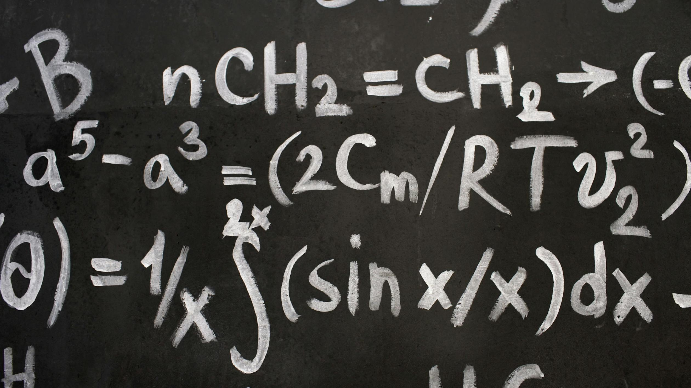

This document demonstrates how to use LaTeX equations in your Markdown files for AstroPaper. LaTeX is a powerful typesetting system often used for mathematical and scientific documents.

<!--
  PERFORMANCE FIX:
  Replaced raw HTML  with Markdown syntax.
  Astro will now automatically:
  1. Convert this to WebP/AVIF (Format Optimization)
  2. Generate multiple sizes (Responsive Images)
  3. Lazy load it with decoding="async"
-->



_Photo by [Vitaly Gariev](https://www.pexels.com/photo/close-up-of-complicated-equations-written-on-a-blackboard-22690748/)_

## Table of contents

## Instructions

In this section, you will find instructions on how to add support for LaTeX in your Markdown files for AstroPaper.

1. Install the necessary remark and rehype plugins by running:

   ```bash title="Terminal"
   pnpm install rehype-katex remark-math katex
   ```

2. Update the Astro configuration to compile LaTeX directly to native **W3C MathML Core**:

   ```ts title="astro.config.ts"
   import remarkMath from "remark-math";
   import rehypeKatex from "rehype-katex";

   export default defineConfig({
     // ...
     markdown: {
       remarkPlugins: [
         remarkMath,
         [remarkToc, { heading: "(table of contents|შინაარსის ცხრილი)" }],
         [remarkCollapse, { test: "(Table of contents|შინაარსის ცხრილი)" }],
       ],
       rehypePlugins: [
         [
           rehypeKatex,
           {
             output: "mathml",
             strict: true,
             throwOnError: false,
           },
         ],
       ],
       shikiConfig: {
         // For more themes, visit https://shiki.style/themes
         themes: { light: "min-light", dark: "night-owl" },
         wrap: false,
       },
     },
     // ...
   });
   ```

   This approach offers key advantages:
   - **Zero CSS bundle overhead**: Removes `katex.min.css` completely.
   - **Native rendering**: Rendered directly by modern browser engines using OpenType MATH tables.
   - **Full Accessibility**: Screen readers pronounce math elements natively.

And _voilà_, this setup allows you to write LaTeX equations in your Markdown files, which will be rendered properly when the site is built. Once you do it, the rest of the document will appear rendered correctly.

---

## Inline Equations

Inline equations are written between single dollar signs `$...$`. Here are some examples:

1. The famous mass-energy equivalence formula: $E = mc^2$
2. The quadratic formula: $x = \frac{-b \pm \sqrt{b^2 - 4ac}}{2a}$
3. Euler's identity: $e^{i\pi} + 1 = 0$

---

## Block Equations

For more complex equations or when you want the equation to be displayed on its own line, use double dollar signs `$$...$$`:

The Gaussian integral:

```latex
$$ \int_{-\infty}^{\infty} e^{-x^2} dx = \sqrt{\pi} $$
```

The definition of the Riemann zeta function:

```latex
$$ \zeta(s) = \sum_{n=1}^{\infty} \frac{1}{n^s} $$
```

Maxwell's equations in differential form:

```latex
$$
\begin{aligned}
\nabla \cdot \mathbf{E} &= \frac{\rho}{\varepsilon_0} \\
\nabla \cdot \mathbf{B} &= 0 \\
\nabla \times \mathbf{E} &= -\frac{\partial \mathbf{B}}{\partial t} \\
\nabla \times \mathbf{B} &= \mu_0\left(\mathbf{J} + \varepsilon_0 \frac{\partial \mathbf{E}}{\partial t}\right)
\end{aligned}
$$
```

---

## Using Mathematical Symbols

LaTeX provides a wide range of mathematical symbols:

- Greek letters: $\alpha$, $\beta$, $\gamma$, $\delta$, $\epsilon$, $\pi$
- Operators: $\sum$, $\prod$, $\int$, $\partial$, $\nabla$
- Relations: $\leq$, $\geq$, $\approx$, $\sim$, $\propto$
- Logical symbols: $\forall$, $\exists$, $\neg$, $\wedge$, $\vee$
